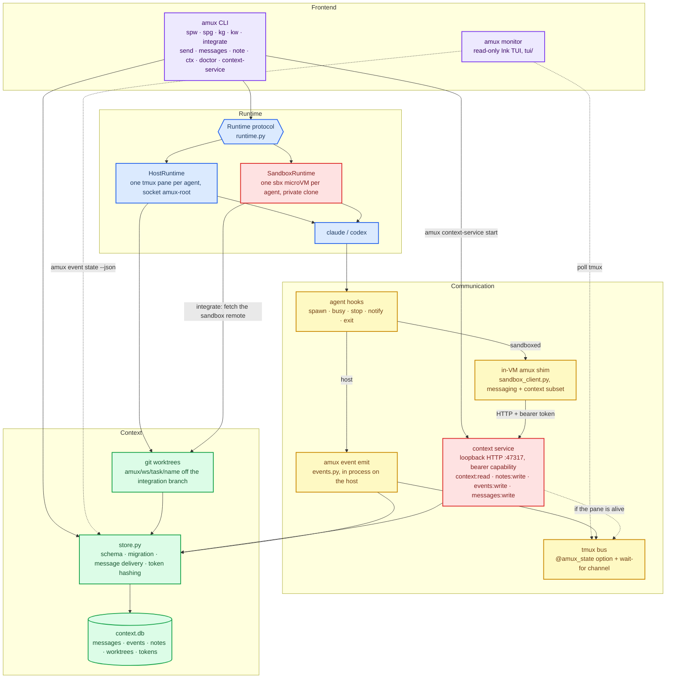

# project goals
- [x] manage agent spawn and close in terminal multiplexers
- [x] send/read messages across panes/windows, human->agent and agent->agent
- [ ] persistence, session/window management, automation
- Design
    - sessions = workspaces
    - windows = tasks
    - panes = agents

# usage
```sh
amux spw myproj -p ~/Git/myproj -r 2 -c 2   # spawn workspace w/ 2x2 claude grid
amux spg myproj review -a codex:2           # add a task (window) w/ 1x2 codex grid
amux spg myproj fix -a claude:3 -a codex    # mixed 2x2: 3 claude + 1 codex (auto shape)
amux spg myproj plan -a claude@opus/high -a codex@gpt-5.6-sol/xhigh   # per-agent model + effort
amux lsw                                    # list workspaces
amux lsg myproj                             # list tasks/agents in a workspace
amux send %9 "please review src/auth"       # wait for idle, send, confirm processing
amux messages --status undelivered          # inspect durable delivery results
amux kg myproj review                       # kill a task
amux kw myproj                              # kill a workspace
amux monitor                                # live dashboard of every workspace/agent
amux monitor -W 160 -T 60                   # ...at 160 cols, 60 of them for the tree
```
- runs on a dedicated tmux server (socket `amux-root`); attach: `tmux -L amux-root attach -t myproj`

## messaging

`amux send <pane> <text...> [--timeout SECONDS]` waits until the target agent is
exactly `idle`, submits one attributed message, and reports `delivered` only
after that same pane emits a fresh `busy` event. The default total deadline is
300 seconds; it also covers waiting behind another sender and waiting for the
target to become idle.

Delivery attempts are durable. `amux messages [-n N] [--status STATUS]
[--json]` lists messages sent or received by the calling pane, where `STATUS`
is `pending`, `delivered`, or `undelivered`. An undelivered result is printed to
stderr and exits nonzero, so the sender cannot mistake tmux accepting
keystrokes for the agent processing them.

The result is intentionally conservative: if an agent processes the prompt but
its hooks never emit `busy`, amux records `undelivered` because it has no stable
evidence of processing. Check the record with `amux messages`; do not retry with
raw `tmux send-keys`, which bypasses idle waiting, attribution, serialization,
and delivery evidence.

## agent specs

`-a` takes `AGENT[@MODEL][/EFFORT][:COUNT]`. Every part is optional, and a spec
with no `@` and no `/` launches exactly what it launched before. Each spec
carries its own values, so a grid can mix a cheap reviewer with an expensive
implementer:

```sh
amux spg myproj fix -r 2 -c 2 -a claude@opus/high:3 -a codex@gpt-5.6-sol/xhigh
```

Model and effort become each CLI's own flags — there is no shared spelling:

| | model | effort |
|---|---|---|
| `claude` | `--model <value>` | `--effort <value>` |
| `codex` | `-m <value>` | `-c model_reasoning_effort=<value>` |

Both apply identically under the host and `docker-sandbox` runtimes, and
`amux ctx` reports what a pane was launched with.

**Values are not checked against any list amux maintains**, so a model or
effort level released after your amux works immediately. The cost is that a
typo is not caught anywhere, and it is quiet rather than loud. Measured against
`claude` 2.1.224 and `codex-cli` 0.146.0: a bad `--effort` makes claude warn and
run on its default, codex accepts the string and displays it, and a bad model on
either agent starts normally and only fails at the first API call. **The pane
survives with a configuration that is not the one you asked for.**

`amux ctx` reports what the pane was *launched* with and cannot know what the
agent did with it, so after a typo the two disagree. The agents differ in how
much their own banner helps: claude's startup box shows the *effective* value
(launch `--effort hgih` and it reads `with high effort`), while codex's `model:`
row merely echoes what you passed and prints a nonexistent model verbatim. For
codex, only the first API call tells you whether the model was real — a pane
left idle on a bogus model reports nothing at all, so a clean-looking startup is
not confirmation.

**Escape hatch.** `@`, `/` and `:` are delimiters, so a model id containing `/`
(`openai/gpt-5`) or ending in `:<digits>` (a Bedrock id like `…-v1:0`) cannot
go in a spec. Launch it as a raw command instead:

```sh
amux spg myproj fix -a 'claude --model openai/gpt-5 --dangerously-skip-permissions'
```

You are trading the grammar for the flag: a raw spec carries no `@MODEL` or
`/EFFORT` of its own, so every flag has to be spelled out — including the ones
amux normally supplies, which is why the example above repeats
`--dangerously-skip-permissions`. It also cannot run under `docker-sandbox`,
and `ctx` and `monitor` print the whole command string in the agent column
instead of `claude` or `codex`.

What a raw command does *not* lose is its work: it still gets its own worktree
and branch, and `amux integrate` merges it like any other agent's.

# architecture



# runtimes

Three execution backends.
- `host` is the default and is unchanged: the agent runs on your machine, in its own git worktree, on the `amux-root` tmux server.
- `docker-sandbox`: each agent runs inside a Docker Sandboxes microVM 
- `apple-container`: each agent runs inside an Apple `container` Linux VM (github.com/apple/container), with its normal host worktree bind-mounted 

## prerequisites

Docker's `sbx` 
```sh
sbx version                       # amux requires >= 0.37.0
sbx policy init balanced          # one-time, host-wide; amux will not do this for you
sbx policy allow network localhost:47317   # only if preflight tells you to
```


## clone, commit, integrate

A sandbox gets a private clone, not a worktree 

```
amux/<ws>/<task>/integration   task integration branch, on the host
amux/<ws>/<task>/<name>        the sandboxed agent's branch, inside the VM
```

```sh
amux spw myproj -p ~/Git/myproj --runtime docker-sandbox -a claude:2 -a codex:2
amux doctor -p ~/Git/myproj        # check sbx, its version, and the network policy
amux integrate myproj task0        # merge each sandbox's committed branch
amux kg myproj task0               # stop the VMs, keep their state for reattach
amux kg myproj task0 --clean       # remove them; refuses a dirty sandbox
amux kg myproj task0 --clean --force   # ...and accept losing uncommitted work
```

## apple-container

Host worktrees, containerized execution. Each agent keeps the normal per-agent
worktree and branch; only the agent process moves into a lightweight Linux VM,
with the repo and the worktree bind-mounted at their host paths. Commits made
inside land directly on the host branch, so `amux integrate`, `kg --clean` and
the branch layout are exactly the host runtime's.

```sh
brew install container                        # Apple's container CLI (macOS 15+)
container system start                       # once per boot; installs a kernel on first run
amux doctor --runtime apple-container -p ~/Git/myproj
amux spw myproj -p ~/Git/myproj --runtime apple-container -a claude:2
amux kg myproj task0 --clean                 # delete the containers and worktrees
```

The default image is `docker.io/library/node:22`; the agent CLI arrives via
`npx` at launch, so first start pulls the image and the package. Point
`--image` at a prebaked image to skip that. Credentials reach the agent only
through the pane's environment (`ANTHROPIC_API_KEY`, `CLAUDE_CODE_OAUTH_TOKEN`,
`OPENAI_API_KEY` are passed through when set); nothing is baked into the
command line.

Two honest limits, by design of the v1: the container has no amux client, so a
containerized agent emits no state events (it reads `idle` while working, like
a raw-command agent) and cannot run `amux ctx`/`note`/`send`; and isolation is
the mount list, not a private clone — the agent can write to its worktree and
to the repo checkout it was spawned from, and nothing else on the host.

## the skill amux installs into your agents

- `skills/amux/SKILL.md` —  teach agent how to use amux

**Spawning installs this document, and overwrites what is already there.** Every
`amux spw` / `amux spg` writes it into the skill directory of each agent kind in
the grid — `~/.claude/skills/amux/SKILL.md` and `~/.codex/skills/amux/SKILL.md` —
so an agent has amux's vocabulary with no prerequisite step, and a stale copy
from an older amux corrects itself. Raw command specs are left alone; amux does
not know where an arbitrary command reads skills.

Presence is not activation, so amux also points the agent at it: `claude` is
launched with the pointer appended to its system prompt, and `codex`, which has
no equivalent flag, is sent a short `[amux]`-prefixed message once its interface
is up. A `codex` agent therefore spends its first turn reading the document.

One thing to expect the first time you spawn into a repository: both agents ask
whether you trust the directory, and amux gives every agent a *fresh worktree*.
An agent parked on that prompt never reaches its input box, so amux waits, gives
up, and says so by name — `was not given amux's skill pointer ... waiting on a
prompt of its own`. Answer the prompt and the agent runs normally; it just was
not told about the skill, so tell it, or respawn once the directory is trusted.
amux does not answer trust prompts for you.

**If you develop amux, this replaces your `make install_skills` symlink.** That
target links `skills/amux` from your checkout into both directories; the next
spawn replaces the link with a real file, and your edits to the checkout stop
reaching newly spawned agents. amux prints the path when it replaces something,
so you can see it happen. Re-run `make install_skills` to restore the live link.

Neither the install nor the activation can fail a spawn. Whatever goes wrong is
reported against the agent it affects, and the grid, its panes, its worktrees and
its sandboxes stay exactly as they are.

## monitor

`amux monitor` opens a read-only dashboard (workspace/task/agent tree, agent
detail, live pane preview). It is a Node app under `tui/`, so build it once:

```sh
cd tui && npm install && npm run build
```

# examples
<table width="100%">
  <tr>
    <th>tui monior</th>
  </tr>
  <tr>
    <td width="100%">
      
    </td>
  </tr>
  <tr>
    <th>context database</th>
  </tr>
  <tr>
    <td width="100%">
      
    </td>
  </tr>
  <tr>
    <th>spawn 2 claude and 2 codex</th>
  </tr>
  <tr>
    <td width="100%">
      
    </td>
  </tr>
</table>
