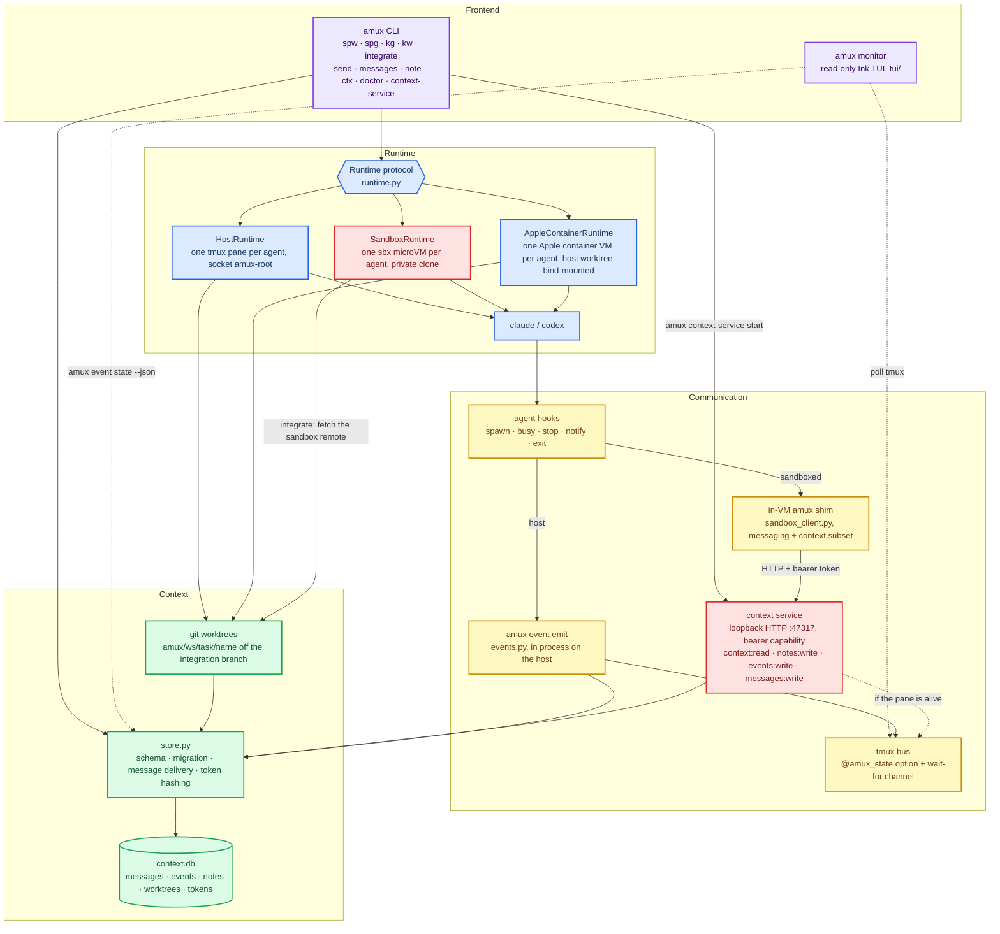

# project goals
- [x] manage agent spawn and close in terminal multiplexers
- [x] send/read messages across panes/windows, human->agent and agent->agent
- [ ] persistence, session/window management, automation
- Design
    - sessions = workspaces
    - windows = tasks
    - panes = agents

# usage
```sh
amux spw myproj -p ~/Git/myproj -r 2 -c 2   # spawn workspace w/ 2x2 claude grid
amux spg myproj review -a codex:2           # add a task (window) w/ 1x2 codex grid
amux spg myproj fix -a claude:3 -a codex    # mixed 2x2: 3 claude + 1 codex (auto shape)
amux spg myproj plan -a claude@opus/high -a codex@gpt-5.6-sol/xhigh   # per-agent model + effort
amux lsw                                    # list workspaces
amux lsg myproj                             # list tasks/agents in a workspace
amux send %9 "please review src/auth"       # wait for idle, send, confirm processing
amux messages --status undelivered          # inspect durable delivery results
amux kg myproj review                       # kill a task
amux kw myproj                              # kill a workspace
amux monitor                                # live dashboard of every workspace/agent
amux monitor -W 160 -T 60                   # ...at 160 cols, 60 of them for the tree
```
- runs on a dedicated tmux server (socket `amux-root`); attach: `tmux -L amux-root attach -t myproj`

## messaging

`amux send <pane> <text...> [--timeout SECONDS]` sends one attributed message to a target pane; `delivered` means the pane went busy afterwards.

`amux messages [-n N] [--status STATUS] [--json]` lists messages sent or received by the calling pane (`pending` / `delivered` / `undelivered`).

## agent specs

`-a` takes `AGENT[@MODEL][/EFFORT][:COUNT]`; every part is optional.

```sh
amux spg myproj fix -r 2 -c 2 -a claude@opus/high:3 -a codex@gpt-5.6-sol/xhigh
```

Model and effort become each CLI's own flags — there is no shared spelling:

| | model | effort |
|---|---|---|
| `claude` | `--model <value>` | `--effort <value>` |
| `codex` | `-m <value>` | `-c model_reasoning_effort=<value>` |

Both apply identically under all three runtimes, and `amux ctx` reports what a
pane was launched with. Values pass through unchecked, so a typo fails at the
agent, not at spawn.

Agents can also be launched with a raw command (e.g. for a model id the spec
grammar cannot express):
```sh
amux spg myproj fix -a 'claude --model openai/gpt-5 --dangerously-skip-permissions'
```

# architecture



# runtimes

Three execution backends.
- `host` (default): the agent runs on your machine, in its own git worktree, on the `amux-root` tmux server
- `docker-sandbox`: each agent runs inside a Docker Sandboxes microVM with a private clone of the repo
- `apple-container`: each agent runs inside an Apple `container` Linux VM (github.com/apple/container) with its normal host worktree bind-mounted

## docker-sandbox

Prerequisites — Docker's `sbx` CLI:
```sh
sbx version                       # amux requires >= 0.37.0
sbx policy init balanced          # one-time, host-wide; amux will not do this for you
sbx policy allow network localhost:47317   # only if preflight tells you to
```

A sandbox gets a private clone, not a worktree.

```
amux/<ws>/<task>/integration   task integration branch, on the host
amux/<ws>/<task>/<name>        the sandboxed agent's branch, inside the VM
```

```sh
amux spw myproj -p ~/Git/myproj --runtime docker-sandbox -a claude:2 -a codex:2
amux doctor -p ~/Git/myproj        # check sbx, its version, and the network policy
amux integrate myproj task0        # merge each sandbox's committed branch
amux kg myproj task0               # stop the VMs, keep their state for reattach
amux kg myproj task0 --clean       # remove them; refuses a dirty sandbox
amux kg myproj task0 --clean --force   # ...and accept losing uncommitted work
```

## apple-container

Host worktrees, containerized execution: only the agent process moves into a
lightweight Linux VM, with the repo and its worktree bind-mounted at their host
paths. Commits made inside land directly on the host branch, so `amux
integrate`, `kg --clean` and the branch layout are exactly the host runtime's.

```sh
brew install container                       # Apple's container CLI (macOS 15+)
container system start                       # once per boot; installs a kernel on first run
amux doctor --runtime apple-container -p ~/Git/myproj
amux spw myproj -p ~/Git/myproj --runtime apple-container -a claude:2
amux kg myproj task0 --clean                 # delete the containers and worktrees
```

The agent CLI arrives via `npx` in the default `docker.io/library/node:22`
image; point `--image` at a prebaked one to skip the first-start pull.
Credentials pass through from the pane's environment (`ANTHROPIC_API_KEY`,
`CLAUDE_CODE_OAUTH_TOKEN`, `OPENAI_API_KEY`), never the command line.

## the skill amux installs into your agents

- `skills/amux/SKILL.md` — teaches agents how to use amux

**Spawning installs this document, and overwrites what is already there.** Every
`amux spw` / `amux spg` writes it into the skill directory of each agent kind in
the grid — `~/.claude/skills/amux/SKILL.md` and `~/.codex/skills/amux/SKILL.md` —
so an agent has amux's vocabulary with no prerequisite step, and a stale copy
from an older amux corrects itself. Raw command specs are left alone; amux does
not know where an arbitrary command reads skills.

## monitor

`amux monitor` opens a read-only dashboard (workspace/task/agent tree, agent
detail, live pane preview). It is a Node app under `tui/`, so build it once:

```sh
cd tui && npm install && npm run build
```

# examples
<table width="100%">
  <tr>
    <th>tui monitor</th>
  </tr>
  <tr>
    <td width="100%">
      
    </td>
  </tr>
  <tr>
    <th>context database</th>
  </tr>
  <tr>
    <td width="100%">
      
    </td>
  </tr>
  <tr>
    <th>spawn 2 claude and 2 codex</th>
  </tr>
  <tr>
    <td width="100%">
      
    </td>
  </tr>
</table>
