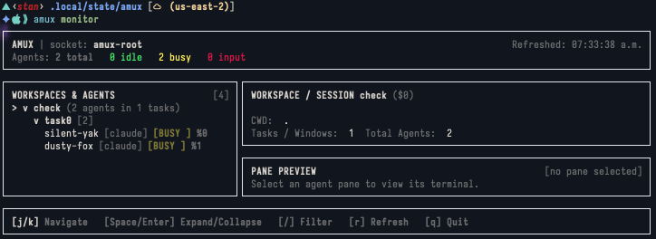
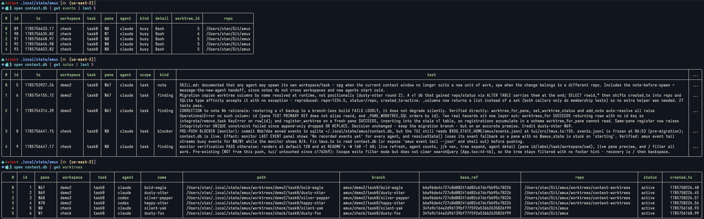
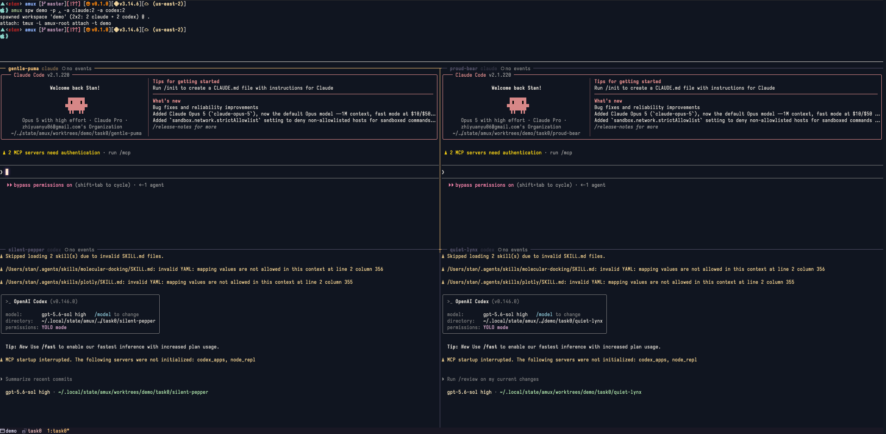

# project goals
- [ ] manage agent spawn and close in terminal multiplexers
- [ ] send/read messages across panes/windows, human->agent and agent->agent
- [ ] persistence, session/window management, automation
- Design
    - sessions = workspaces
    - windows = tasks
    - panes = agents

# usage
```sh
amux spw myproj -p ~/Git/myproj -r 2 -c 2   # spawn workspace w/ 2x2 claude grid
amux spg myproj review -a codex:2           # add a task (window) w/ 1x2 codex grid
amux spg myproj fix -a claude:3 -a codex    # mixed 2x2: 3 claude + 1 codex (auto shape)
amux lsw                                    # list workspaces
amux lsg myproj                             # list tasks/agents in a workspace
amux kg myproj review                       # kill a task
amux kw myproj                              # kill a workspace
amux monitor                                # live dashboard of every workspace/agent
amux monitor -W 160 -T 60                   # ...at 160 cols, 60 of them for the tree
```
- runs on a dedicated tmux server (socket `amux-root`); attach: `tmux -L amux-root attach -t myproj`

## monitor

`amux monitor` opens a read-only dashboard (workspace/task/agent tree, agent
detail, live pane preview). It is a Node app under `tui/`, so build it once:

```sh
cd tui && npm install && npm run build
```

# examples
<table width="100%">
  <tr>
    <th>tui monior</th>
  </tr>
  <tr>
    <td width="50%">
      
    </td>
  </tr>
  <tr>
    <th>context database</th>
  </tr>
  <tr>
    <td width="100%">
      
    </td>
  </tr>
  <tr>
    <th>spawn 2 claude and 2 codex</th>
  </tr>
  <tr>
    <td width="100%">
      
    </td>
  </tr>
</table>
